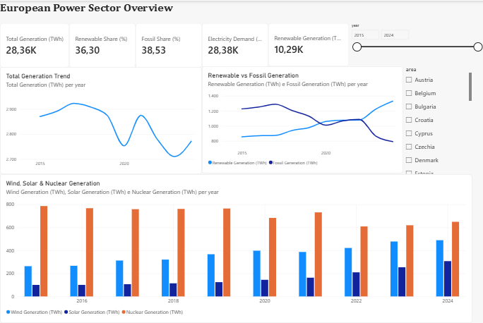
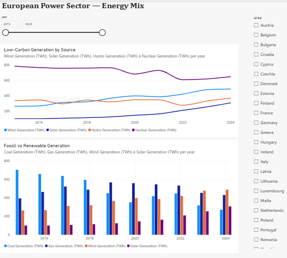
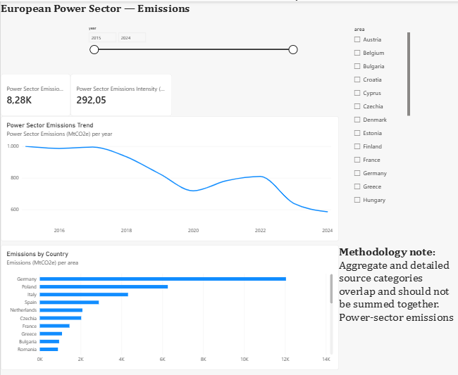

# European Power Sector BI

## Project Overview

This project analyzes the evolution of the European power sector between **2015 and 2024**, focusing on electricity generation, energy mix, renewable growth, fossil-fuel dependence, power-sector emissions, and carbon intensity.

The project follows an end-to-end Business Intelligence workflow, from raw data validation and SQL modeling to Power BI dashboard development and business insight generation.

## Business Questions

The analysis focuses on the following questions:

- How has total electricity generation evolved between 2015 and 2024?
- How quickly has renewable generation grown?
- How has fossil generation changed?
- How have wind and solar contributed to the transformation of the electricity mix?
- How have power-sector emissions and emissions intensity evolved?
- How do generation and emissions differ across European countries?

## Tools & Technologies

- **SQL Server / T-SQL** — database design, data validation, transformation, and analytical queries
- **Power Query** — ETL and data preparation
- **Power BI** — dimensional modeling, DAX measures, interactive dashboards, and visualization
- **Excel** — initial data audit and validation
- **GitHub** — project documentation and portfolio presentation

## Data Model

The analytical model follows a **star schema**.

### Fact Table

`analytics.fact_electricity`

Contains electricity-generation and emissions metrics at the grain of:

**Area × Year × Electricity Source**

### Dimension Tables

- `analytics.dim_area`
- `analytics.dim_year`
- `analytics.dim_electricity_source`

The Power BI semantic model uses three active many-to-one, single-direction relationships between the fact table and dimensions.

## Dashboard

The Power BI report contains three main pages.

### 1. Overview

Provides a high-level view of:

- Total electricity generation
- Renewable generation and share
- Fossil generation and share
- Electricity demand
- Renewable vs fossil generation trends
- Wind, solar, and nuclear generation



### 2. Energy Mix

Explores the evolution of major generation technologies, including:

- Wind
- Solar
- Hydro
- Nuclear
- Coal
- Gas



### 3. Emissions

Focuses on:

- Power-sector emissions
- Power-sector emissions intensity
- Historical emissions trend
- Emissions comparison by country



## Key Findings

Between 2015 and 2024:

| Metric | 2015 | 2024 | Change |
|---|---:|---:|---:|
| Total Generation | 2,870.37 TWh | 2,771.53 TWh | -3.44% |
| Renewable Generation | 855.94 TWh | 1,329.81 TWh | +55.36% |
| Fossil Generation | 1,227.74 TWh | 792.17 TWh | -35.48% |
| Wind Generation | 263.28 TWh | 489.34 TWh | +85.86% |
| Solar Generation | 100.20 TWh | 307.26 TWh | +206.65% |
| Power-Sector Emissions | 999.82 MtCO2e | 586.59 MtCO2e | -41.33% |
| Emissions Intensity | 348.32 gCO2e/kWh | 211.65 gCO2e/kWh | -39.24% |
| Renewable Share | 29.82% | 47.98% | +18.16 pp |
| Fossil Share | 42.77% | 28.58% | -14.19 pp |

## Main Insights

Renewable electricity generation increased substantially during the period, rising by more than **55%**.

Solar experienced the fastest relative growth, increasing by more than **200%**, while wind generation increased by approximately **86%**.

At the same time, fossil generation declined by approximately **35%**.

Power-sector emissions fell by more than **41%**, while emissions intensity declined by approximately **39%**.

Overall, the results show a substantial shift in the analyzed electricity mix toward renewable generation and lower carbon intensity between 2015 and 2024.

## Data Validation & Modeling Decisions

Several SQL data-quality checks were performed before building the final report, including:

- Fact-table row-count validation
- Duplicate-grain checks
- Dimension-key validation
- Orphan-key checks
- SQL-to-Power-BI KPI reconciliation

An important modeling issue was identified during validation: the dataset contains both **aggregate and detailed electricity-source categories**.

For example, categories such as `Total generation`, `Thermal`, `Fossil`, `Coal`, and `Gas` overlap and therefore cannot be summed indiscriminately without introducing double counting.

Power-sector emissions are therefore calculated using only the `Total generation` category.

European renewable and fossil shares are calculated from aggregated generation values rather than by averaging country-level percentages.

A further validation showed that, within this dataset:

**Thermal = Fossil + Bioenergy**

while **Nuclear is excluded from Thermal**.

## Recommendations

Based on the descriptive analysis:

- Continue expanding renewable electricity generation, particularly wind and solar.
- Continue monitoring the reduction in fossil generation alongside changes in total electricity demand and generation.
- Use country-level comparisons to identify markets where power-sector emissions remain comparatively high.
- Monitor both electricity mix and emissions intensity when evaluating progress in power-sector decarbonization.

## Limitations

- The dataset uses annual observations, so monthly, seasonal, and hourly electricity-system dynamics are outside the scope of the analysis.
- The analysis covers **2015–2024** and does not provide forecasts.
- Aggregate and detailed electricity-source categories overlap and require careful filtering to prevent double counting.
- European-level percentage KPIs require appropriate aggregation rather than simple averages across countries.
- The analysis is descriptive and does not establish causal relationships between changes in generation mix and emissions.

## Repository Structure

```text
european-power-sector-bi/
├── data/
├── sql/
│   └── european_power_sector_analysis.sql
├── powerbi/
│   └── European_Power_Sector_Analysis.pbix
├── screenshots/
│   ├── overview.png
│   ├── energy_mix.png
│   └── emissions.png
└── README.md
```

## SQL Analysis

The SQL script contains the main validation and analytical queries used in the project, including:

- Total generation by year
- Renewable generation by year
- Power-sector emissions
- Emissions intensity
- Renewable and fossil shares
- 2015 vs 2024 generation comparison
- Thermal-category validation
- Duplicate and orphan-key checks

## Project Outcome

The project demonstrates an end-to-end BI workflow combining **data auditing, SQL, dimensional modeling, Power Query, DAX, data visualization, KPI validation, and business analysis**.

Special attention was given to validating the semantic meaning of aggregate electricity-source categories and ensuring that the final Power BI KPIs do not introduce double counting or misleading aggregations.